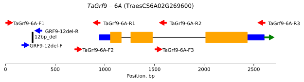

## Gene visualization

This Jupiter Notebook contains a Python function that allows you to draw an illustration of a gene structure (exons, introns, CDS) and visualize polymorphisms and primer positions on this schematic. The illustration is based on the alignment of the chromosome (Chr), exons, and protein-coding (CDS) sequences. The primers should be placed in separate files, along with their names. The positions of a few polymorphisms can be given in the code.

### Example

```python
draw_gene(fasta_file = 'Grf9-6A_for_short_gene_scheme.fasta',
          gene_name = 'TaGrf9-6A',
          gene_id = 'TraesCS6A02G269600',
          primer_file = 'TraesCS6A02G269600_primers_short.txt',
          marker_file= 'TraesCS6A02G269600_marker.txt',
          polymorphisms = [(267, 278, '12bp_del')],
          polymorphism_positions=[0.4, 0.4],
          primer_positions = [0.65, 0.15, 0.85, 0.02, 0.50, 0.3, 0.7, 0.0],
          marker_positions = [0.23, 0.5],
          min_marker_dist_fraction = 0.2)
```


